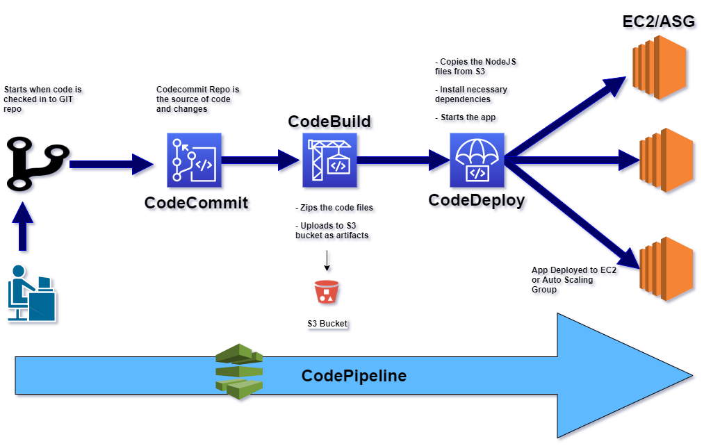

# A Codepipeline example to deploy a NodejS app on AWS  

In this post I will be walking thorugh a simple Codepipeline flow to deploy a NodejS app on EC2.The flow described here is a very simple flow to give a basic demonstartion of how to setup and run a Codepipeline flow.To follow through you will need a basic understanding of CI/CD and some basic AWS understanding. Rest you can follow through step by step to setup your own pipeline.  

## What is Codepipeline?  
Codepipeline is a service provided by AWS. It is an AWS managed fully automated Continuous delivery service.Based on the configuration defined, it automates the steps which starts from checking in the code, bulding the code, testing the code and finally deploying the same to Production systems.This full end to end process is handled by Codepipeline and without any manual interventon if configured so.Using this one can automate what tests are ran on the code, how and where the code is deployed and all without manually spinning up any servers like Build servers.  

Here I will explain a process about how you can setup a basic Codepipeline flow using a NodeJS app as an example.In this example I havent included any test phase but in actual Production pipelines, a test phase will be a mandatory part.  

## What will we build  

In this example we will setup a pipeline to build and deploy a NodeJS app. The app itself is a simple NodeJS app using Express. The app provides an interface to add products to a MongoDB database and then display the list of products by reading the products from the database.All the dependencies are defined in the package.json file.  
<an image of the app>  

Below is the flow which I will be walking through in this post. Lets get to know each phase or step of the flow.Below I will provide a brief explanation of each phase involved and various files /scripts involved in each phase.  

  

### CodeCommit  
This is the GIT repo where the code will be checked in.This will serve as a starting point of the release process.When code is checked in the repo, it triggers an execution of the pipeline which then follows multiple phases to finally deploy the code to Production.  

### CodeBuild  
This step performs a build of the code which was checked in the last step.Also this is the step where we can run various tests on the code to make sure the checked in code works and wont break the overall application.Generally we have a deployment artifact generated in this step which will serve as the package to be deployed in subsequent phases like deploy in stage for testing, deploy to production etc.  
In my example I have skipped the testing step but it is always a good practice, in fact a mandatory practice to include test steps in the Build phase to make sure the code changes dont break the system.Below are the tasks which are performed in this example flow. The build details are specified in a file named buildspec.yml in the root directory:  
- Spins up the build server  
- Install package: zip on the server  
- Zips up the code files in the webscripts folder  
- Uploads the files as artifat to a specified S3 bucket  

### CodeDeploy  
In this phase we will deploy the artifact that was produced by the Codebuild phase, to production.In a proper release pipeline, there can be multiple Code Deploy phases which can handle multiple deployments like deploying to a Test environment for testing, Deploy to stage environment for testing etc.Regardless how many deployment phases you need, the basic steps remain same which I will be going thorugh here.  

The definition of the deployment is specified in multiple files and scripts. Let me go through each of them briefly:  
- appspec.yml: This file controls the overall steps the deployment will perform on the server. A series of steps define what files will be deployed and what scripts will be ran on the server to complete the deployment.We define the below sections to control how and what is deployed:  
1. <em>files: </em>Defines what file is deployed from the input artifact and to what folder on the destination server.  
2. <em>BeforeInstall: </em>In this step we install any dependencies which are needed by our app to run on the server.Here we define the name of the script which will be executed on the server to install the dependencies.In this example we are installing Nodejs and npm on the server to run our nodeJS app.  
3. <em>AfterInstall: <em>Here we can run any other scripts or commands on the server which are pre-requisites for the final app to run.In our example we are executing npm install command to install the NodeJS packages defined in the package.json of the application.  
4. <em>ApplicationStart: <em>This is the final step where we run the script to start up the application.The script and commands will differ based on what application you are starting.Here we run the npm command to start up the express server in the NodeJS app.This depicts the final step of the deployment once application starts successfully.  

In this example we are deploying the application to an Auto scaling group which consists of multiple EC2 instances.So the final target of the deployment is specified as the Auto scaling group. The deployment scripts are executed on each of the instance from the auto scaling group.  


## Walkthrough of the Setup  
Let us go through the steps to setup and run the pipeline.While goigh through the steps, for some of the parts I will not go into much detail as they are full topics in themselves.I will point to needed documentation to help through the steps if you are still new to AWS.  

### Intial Preparations:  
- <em>AWS Account: </em>Of course we will need an AWS account. Go ahead and register for a free tier account on AWS  
- <em>IAM User: <em>Create an IAM user which will be used throughout this process. Provide required admin permissions to this user.Also to use the user for Codecommit, generate the GIT credentials and note credentials.  
  
- <em>Custom Policy and Instance profile: </em>The instances where the deployment will happen, need to have a specific role/instance profile associated to them to provide certain permissions.In this step you have to create a custom policy and a custom role attaching the custom policy to it.Below is the policy to be associated to the instance role:  

```
{
    "Version": "2012-10-17",
    "Statement": [
        {
            "Action": [
                "s3:Get*",
                "s3:List*"
            ],
            "Effect": "Allow",
            "Resource": "*"
        }
    ]
}
```  

- <em>A service role for Codedeploy: </em>Create a service role which will be used by Codedeploy to perform varipus deployment functions.While creating the role, select the Codeploy use case so that needed permissions are added to the role.  
  

- <em>S3 Bucket: </em>Create the S3 bucket which will be used to store the output artifacts from the CodeBuild phase.  
  

### Pipeline setup  
Once we are done with the initial steps, next we start setting up the components of the pipeline.  

- <em>Setup EC2/Auto Scaling Group: </em>Here we are setting up the Auto scaling group where the app will be deployed. Please follow the steps in this document to create an ASG and launch the instances.(https://docs.aws.amazon.com/autoscaling/ec2/userguide/create-asg.html). My example is specific to Ubuntu OS so make sure to select Ubuntu AMI and make sure to attach the below script as User data while creating the laucnh configuration.This will install the Codedeploy agent which is needed by Codedeploy to deploy and start the app.  
```
#!/bin/bash
apt-get -y update
apt-get -y install ruby
apt-get -y install wget
cd /home/ubuntu
wget https://aws-codedeploy-us-east-1.s3.amazonaws.com/latest/install
chmod +x ./install
./install auto
```  

- <em>Codecommit Repo: </em>Here we create the GIT repo to check in the code and will be the trigger for the pipeline.Create the Codecommit repository in AWS. Copy the repository URL.To push the code to this repository, checkout or download my Github repository to your local machine.Run the following command to add a remote URL to the GIT repository and point it to the Codecommit repo created above.  

```
git remote add neworigin <repo_url>
```  
Once asked for credentials, provide the GIT credentials of the IAM user which we created during initial preparations.Once done, commit and push the code to the repository.  
```
git add .
git commit -m "Initial"
git push neworigin master
```  

- <em>CodeBuild Project: </em>Next we will create the Codebuild project to perform the build tasks.Navigate to CodeBuild in AWS and create a new project.Make sure to provide the following. Rest can be kept at default values:  
- Select the Source as Codecommit and select the repo name from previous step.  
  
- Select the OS as Ubuntu  
- Select the Artifact output as S3 and provide the bucket name which we created in the preparations step. This is where the artifact will be stored.Also select the packaging as Zip.  
  

- <em>CodeDeploy Application and Deployment: </em>Now we will ready the deployment step and configure all settings to deploy on the Auto scaling group we created.Follow the below step by step to setup the deployment:  
1. Create the Application: Create the Codedeploy application and select the platform as EC2  
2. In next screen, click on Create Deployment group to start creating the deployment group. In the create page, select the custom Codedeploy role which was created earlier, select the ASG name which we created earlier. Rest options can be left at default.  
  

- <em>Create the AWS Codepipeline pipeline: </em>In this final step we build the pipeline using the earlier phases we created.Below are some needed details for each of the screens for this:  
1. In the 1st screen, provide a name of the Pipeline and the name of a new service role which will be created for Codepipeline use.Keep all other settings at default  
2. In Source provider step, select Codecommit as source and provide the details of the Codecommit which we created earlier  
 
3. In the Build stage, select CodeBuild as build provider and select the Codebuild project which we created before.  
  
4. In the Deploy stage, select CodeDeploy as the deploy provider. For the Application name select the CodeDeploy application we created earlier and for the Deployment group, select the CodeDeploy deployment group which we created earlier.  
  
5. Confirm the settings in the final screen and Click on Create. This will create the pipeline and within minutes will start running the pipeline

### Pipeline Execution  
Once the pipeline is successfully created in the last step, it should have automatically started running. Wait for the run to finish. If it succeeds the deployment of the NodeJS application is complete. To test, copy one of the instance URLs from the earlier step and launch a browser with this: http://<instance_dns>:3000.If you see this page, the deployment was successful!!!  

  

To re-run the pipeline, just modify something in the code and push another code revision to the CodeCommit repo. This will trigger another run of the pipeline.ALso to manually trigger, just click on Release pipeline button on the Codepipeline page for this pipeline on AWS console.

### Troubleshooting  
There can be times when the release pipeline will fail. The phase which fails will be highlighted on the pipeline page. To check what failed, click on the details for that step to check the logs for that phase. The logs will help identify what went wrong in the phase.Fix the issue, re-commit and push a code revision to the repositiory.This will trigger another instance of the pipeline.  
  


## Conclusion  
In this long post we went through various steps and actions needed to setup an end to end release pipeline on AWS CodePipeline.This post should help you with a basic understanding a basic pipeline works and setup on Codepipeline. This example is not a production grade pipeline as it misses many mandatory phases like testing, stage deployment etc.Once you understand the basic setup of the pipeline, you can experiment and add more phases to the pipeline to handle complex scenarios.For any questions or issues please reach out to me at amlanc@chakladar.com.